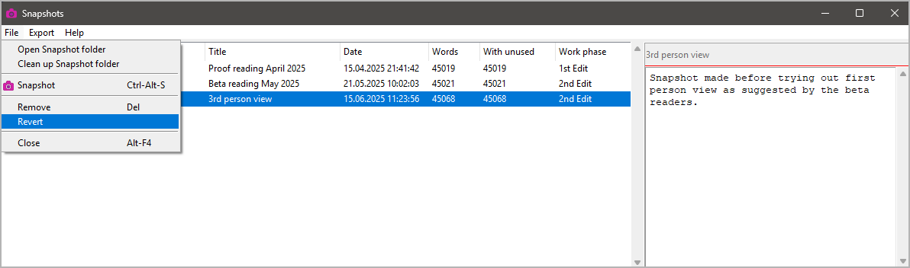

#  nv_snapshots

The [novelibre](https://github.com/peter88213/novelibre/) Python program helps authors organize novels.  

*nv_snapshots* is a plugin providing a snapshot manager. 

## Features

- Snapshots are user defined versions of a project file. 
- Snapshot are zipfiles containing the `.novx` file and a descriptive text file. 
- Snapshots are located in a `snapshot` subdirectory of the project folder. 
- Saving a snapshot is manually triggered via `Ctrl`-`Alt`-`S` or a "File" menu command.

## Requirements

- [novelibre](https://github.com/peter88213/novelibre/) version 5.29+

## Download and install

### Default: Executable Python zip archive

Download the latest release [nv_snapshots_v0.8.0.pyzw](https://github.com/peter88213/nv_snapshots/raw/main/dist/nv_snapshots_v0.8.0.pyzw)

- Launch *nv_snapshots_v0.8.0.pyzw* by double-clicking (Windows/Linux desktop),
- or execute `python nv_snapshots_v0.8.0.pyzw` (Windows), resp. `python3 nv_snapshots_v0.8.0.pyzw` (Linux) on the command line.

#### Important

Many web browsers recognize the download as an executable file and offer to open it immediately. 
This starts the installation.

However, depending on your security settings, your browser may 
initially  refuse  to download the executable file. 
In this case, your confirmation or an additional action is required. 
If this is not possible, you have the option of downloading 
the zip file. 

### Alternative: Zip file

The package is also available in zip format: [nv_snapshots_v0.8.0.zip](https://github.com/peter88213/nv_snapshots/raw/main/dist/nv_snapshots_v0.8.0.zip)

- Extract the *nv_snapshots_v0.8.0* folder from the downloaded zipfile "nv_snapshots_v0.8.0.zip".
- Move into this new folder and launch *setup.pyw* by double-clicking (Windows/Linux desktop), 
- or execute `python setup.pyw` (Windows), resp. `python3 setup.pyw` (Linux) on the command line.

---

[Changelog](docs/changelog.md)

## Usage

See the [online manual](https://peter88213.github.io/nvhelp-en/nv_snapshots/)

---

## Credits

- The logo is made using the free *Pusab* font by Ryoichi Tsunekawa, [Flat-it](http://flat-it.com/).

## License

This is Open Source software, and the *nv_snapshots* plugin is licensed under GPLv3. See the
[GNU General Public License website](https://www.gnu.org/licenses/gpl-3.0.en.html) for more
details, or consult the [LICENSE](https://github.com/peter88213/nv_snapshots/blob/main/LICENSE) file.
